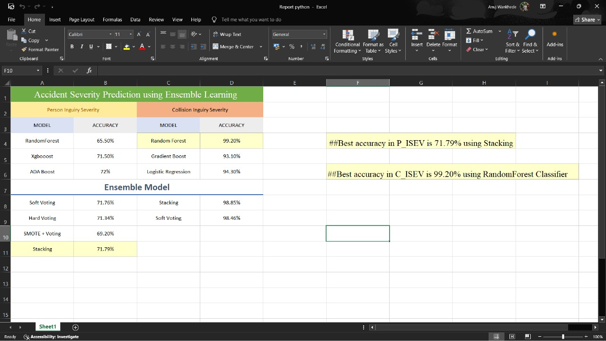

# 🚦 Accident Severity Prediction (AI/ML)

[](https://www.python.org/)
[](https://jupyter.org/)
[](https://scikit-learn.org/)
[](#)

Predict traffic accident severity using Machine Learning. This project builds and evaluates classification models for:
- **P_ISEV** — *Person Injury Severity*
- **C_SEV** — *Collision Severity*

A key focus is improving **P_ISEV** performance under class imbalance using **SMOTE + Random Forest (Ensemble Learning)**.

---

## ✨ What’s Inside
- End-to-end ML workflow: **cleaning → encoding → train/test → modeling → evaluation**
- Imbalance handling with **SMOTE**
- Ensemble approaches: **Random Forest**, **Voting**, **Stacking**
- Metrics: **Accuracy**, **Confusion Matrix**, **Classification Report**
- Jupyter notebook implementation (easy to run and modify)

---

## 📸 Output (Example)


> Results vary based on sampling/feature selection. Final metrics are available inside the notebook outputs.

---

## 🧰 Tech Stack
- **Python 3.x**
- **Jupyter Notebook**
- **Pandas, NumPy**
- **scikit-learn**
- **imbalanced-learn (SMOTE)**
- **Matplotlib, Seaborn**
- **XGBoost** (used in experiments, optional)

---

## 📁 Project Structure
```text
.
├── AIML_CP-checkpoint.ipynb        # Main notebook (training + evaluation)
├── 2019_dataset_en.csv             # Dataset (expected locally; see Dataset section)
├── output.jpg                      # Output screenshot used in README
└── README.md
````
---

## ⚙️ Installation

### 1) Clone the repository

```bash
git clone https://github.com/Anuz-bit/accident-severity-prediction.git
cd accident-severity-prediction
```

### 2) Create a virtual environment (recommended)

```bash
python -m venv .venv
```

**Windows**

```bash
.venv\Scripts\activate
```

**macOS/Linux**

```bash
source .venv/bin/activate
```

### 3) Install dependencies

```bash
pip install -U pip
pip install pandas numpy scikit-learn imbalanced-learn matplotlib seaborn jupyter
```

**Optional (only if you want XGBoost cells to run):**

```bash
pip install xgboost
```

---

## ▶️ Usage

### Run the notebook

```bash
jupyter notebook
```

Open:

* `AIML_CP-checkpoint.ipynb`

Then run cells top-to-bottom.

### Dataset file expected

The notebook currently loads:

```python
pd.read_csv("2019_dataset_en.csv", low_memory=False)
```

So make sure `2019_dataset_en.csv` is in the **same folder** as the notebook (or update the path in the notebook).

---

## 🧪 Method Overview

### For Person Injury Severity (P_ISEV)

* Preprocessing + encoding (`get_dummies`)
* Stratified split
* **SMOTE oversampling**
* **Random Forest (Ensemble)** as the main model
* Comparison experiments with **Voting** / **Stacking**

### For Collision Severity (C_SEV)

* Similar pipeline with baseline/ensemble models for comparison

---

## 🤝 Contributing

Contributions are welcome!

1. Fork the repo
2. Create a new branch
   `git checkout -b feature/your-feature`
3. Commit changes
   `git commit -m "Add: your feature"`
4. Push to your fork
   `git push origin feature/your-feature`
5. Open a Pull Request

**Ideas to contribute**

* Add `requirements.txt`
* Add hyperparameter tuning (GridSearchCV/RandomizedSearchCV)
* Add F1-score / ROC-AUC / PR-AUC reporting
* Add explainability (feature importance / SHAP)
* Add a simple Streamlit demo

---

## 📌 Dataset & Credits

This project uses an accident dataset sourced from **Kaggle**. Full credit goes to the original dataset publisher and Kaggle for hosting the data.

> If you are the dataset owner and would like the credit format changed or the data removed, please raise an issue.

---

## 👤 Author

**Anuj Wankhede**
GitHub: [@Anuz-bit](https://github.com/Anuz-bit)

---

## 🎨 Icon Credit

External link icon by **Bharat Icons** from **Flaticon**.
